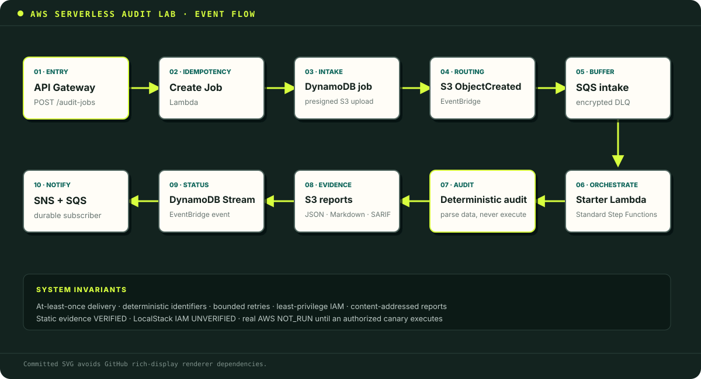

# AWS Serverless Audit Lab

[](https://github.com/marcusmayo/aws-serverless-audit-lab/actions/workflows/ci.yml)

An evidence-first reference service for reviewing AWS serverless and Infrastructure-as-Code tasks. It evolves the API/data patterns in this portfolio's **Digital Value Chain** and the S3/report patterns in **Edenred Invoice Assistant**, then adds the failure handling, IAM boundaries, deterministic checks, and claim discipline expected of an AWS task auditor.

> **Evidence boundary:** the application and audit rules are validated locally through unit/static tests. LocalStack is an optional integration lane. IAM enforcement, managed-service retry timing, stream ordering, and other control-plane behavior remain **UNVERIFIED** until the real-AWS canary runs. No production-deployment claim is made.

## What this demonstrates

| Review area | Concrete evidence in this project |
|---|---|
| Multi-service integration | API Gateway/Lambda/DynamoDB → S3/EventBridge/SQS-DLQ → Step Functions → report S3; DynamoDB Streams → EventBridge → SNS/SQS |
| Event correctness | Versioned event envelope, payload checks, EventBridge failure inspection, stable execution names |
| Failure semantics | Partial-batch responses, bounded stream retries, bisect-on-error, SQS redrive, Step Functions `Retry`/`Catch` and compensation |
| IAM boundaries | Per-function actions and resource ARNs; exact queue/topic source conditions; no plaintext secrets |
| Idempotency | Conditional DynamoDB writes, request-hash conflict detection, deterministic job IDs, execution names and report keys |
| IaC quality | AWS SAM/CloudFormation, encryption, PITR, retention/lifecycle controls, alarms, concurrency caps |
| Auditor behavior | Weighted rubric, machine-readable findings, deliberately flawed task fixtures, remediation and verification instructions |
| Fidelity judgment | Explicit LocalStack-vs-AWS matrix and a manual AWS parity lane |

## Architecture



Submitted templates are parsed as data and are never executed. The end-to-end delivery contract is **at least once**. Duplicate delivery is expected; consumers must be idempotent. A DLQ is a quarantine, not an automatic replay loop.

## Quick start

Requirements: Python 3.12+, Docker (optional), AWS SAM CLI (for SAM validation/build).

```bash
cd aws-serverless-audit-lab
python -m venv .venv
source .venv/bin/activate
pip install -r requirements-dev.txt
make test
make audit
```

## Codespaces browser preview

1. On this repository, select **Code → Codespaces → Create codespace on main**.
2. The dev container installs the deterministic development dependencies automatically.
3. In the Codespaces terminal, run:

   ```bash
   make preview
   ```

4. When Codespaces reports that port `8000` is available, select **Open in Browser**. If the prompt is dismissed, open the **Ports** panel, find port `8000`, and select its globe icon.
5. Paste or upload a SAM/CloudFormation YAML or JSON template and select **Run static audit**.
6. Select **Run oracle suite** to compare all deliberately flawed fixtures with their strict, repository-owned expectations.

The preview parses submitted templates as data; it does not execute or deploy them. Its port is private by default. Results prove only deterministic static checks: LocalStack IAM remains **UNVERIFIED** and real AWS remains **NOT_RUN**. Stop the preview with `Ctrl+C`.

To exercise the repository from the same Codespace:

```bash
make test
make lint
make audit
make oracle
make validate  # requires the SAM CLI included in the dev container
```

An oracle result of **MATCH** means the auditor returned the expected decision, rule IDs, severities, paths, and evidence boundaries. It does **not** mean the flawed fixture is safe or that AWS behavior was exercised. Oracle manifests reject duplicate keys, unknown assertion fields, malformed rule IDs, and client-supplied expectations.

Run the optional LocalStack lane only when `LOCALSTACK_AUTH_TOKEN` is configured:

```bash
make localstack-up
```

Validate the CloudFormation/SAM template:

```bash
sam validate --lint --template-file template.yaml
cfn-lint template.yaml
```

## Run the auditor

```bash
python -m audit.audit_template template.yaml --format markdown
python -m audit.audit_template task_cases/T01_iam_secret/template.yaml --format json
python -m audit.audit_template task_cases/T02_retry_semantics/template.yaml --format markdown
```

The command exits non-zero when it finds a `CRITICAL` or `HIGH` issue, making it usable as a grading gate. Each finding includes severity, evidence path, AWS behavior, impact, remediation, and a verification step.

Run the independent regression oracle from a terminal:

```bash
python -m audit.oracle
python -m audit.oracle --format json
```

The oracle exits non-zero on a **MISMATCH** and exits `2` when a trusted expectation manifest is invalid.

## Audit corpus

| Case | Defect under review | Expected signal |
|---|---|---|
| `T01_iam_secret` | Wildcard IAM and a plaintext secret | Two high-severity findings |
| `T02_retry_semantics` | SQS whole-batch retry, no DLQ, unsafe visibility timeout | Reliability findings with duplicate/poison-message impact |
| `T03_local_green_cloud_red` | A template that can look healthy in an emulator while IAM and API auth remain wrong | Static finding plus real-AWS negative-canary requirement |

## Validation lanes

| Lane | Runs by default | What it can prove |
|---|---:|---|
| Unit + audit corpus | Yes | Handler logic, idempotency decisions, partial-batch behavior, deterministic findings |
| `ruff` + `cfn-lint` + `sam validate --lint` | Yes in CI | Syntax, transform, and static IaC defects |
| LocalStack integration | Only with token | Basic service wiring and request/response contracts |
| Ephemeral real-AWS canary | Manual, operator-controlled | IAM denial, actual retry/DLQ timing, stream behavior, Step Functions semantics, CloudWatch evidence |

LocalStack IAM checks are reported as **NOT_RUN/UNVERIFIED**, never as PASS. See [LocalStack fidelity](docs/localstack-vs-aws.md).

The repository intentionally does not install a persistent workflow that can assume an AWS role and create or delete IAM-bearing stacks. An authorized operator can deploy with `samconfig.toml.example`, run `python scripts/aws_canary.py --stack-name <isolated-stack> --region <region>`, retain the redacted manifest, and explicitly tear down the sandbox.

## Source-to-improvement map

This project reuses patterns, not unverifiable claims:

- **Digital Value Chain:** Lambda, API Gateway, DynamoDB, and SAM foundations; here the public unauthenticated routes, plaintext parameter default, broad CRUD grants, missing idempotency, and missing failure paths are corrected.
- **Edenred Invoice Assistant:** Lambda/S3 request-and-report patterns and cost-awareness; here the topology is made reproducible in IaC without claiming an unverified live SageMaker invocation.
- **Keel/Aegis/Fleet:** deterministic verification, bounded claims, tamper-aware evidence, and adversarial review habits; here those practices become a serverless task rubric and regression corpus.

The exact review is recorded in [source-project review](docs/source-project-review.md).

## Repository layout

```text
audit/                 deterministic audit CLI, rubric, and regression oracle
docs/                  semantics, fidelity, cost, and methodology
src/                    Lambda handlers
statemachines/          Amazon States Language definition
task_cases/             intentionally flawed review fixtures
tests/                  unit and audit-regression tests
preview/                local browser UI for Codespaces
template.yaml           deployable AWS SAM/CloudFormation reference
```

## Cost and teardown

The template uses on-demand DynamoDB, Standard Step Functions, bounded Lambda concurrency, log retention, and S3 lifecycle expiration. These reduce idle cost but do not make the stack free. Deploy into an isolated sandbox and delete it after evidence capture. See [cost model](docs/cost-model.md).

## License

Apache-2.0. The deliberately flawed fixtures are educational examples and must not be deployed unchanged.
